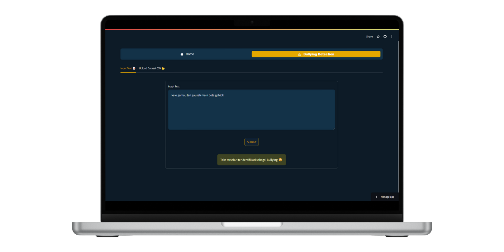
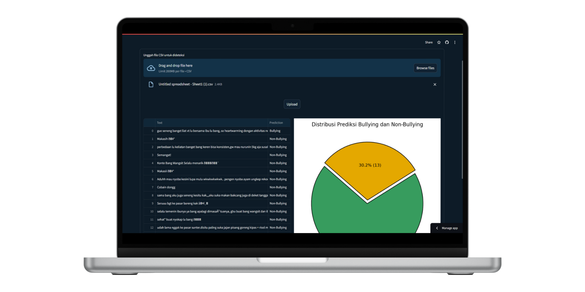

  <h1><strong>EDM Challenge - Kelompok 4</strong></h1>
  <table style="margin-top: 50px; margin-bottom: 30px; width: 80%; text-align: center;">
    <tr>
      <th>Nama Anggota</th>
      <th>NIM</th>
    </tr>
    <tr>
      <td>Ahmad Fauzi</td>
      <td>1202220263</td>
    </tr>
    <tr>
      <td>Alvaro Cleosanda</td>
      <td>1202220181</td>
    </tr>
    <tr>
      <td>Vilson</td>
      <td>1202220199</td>
    </tr>
  </table>

 

---

# 🎯 **Sentinel: Deteksi Komentar Bullying di Media Sosial**

  

Sentinel adalah project dari kelompok kami untuk menghasilkan sebuah model analisis sentimen yang dirancang untuk mendeteksi komentar di media sosial, khususnya untuk mengidentifikasi apakah sebuah komentar termasuk dalam kategori bullying atau non-bullying. Proyek ini menggabungkan model machine learning dengan implementasi dalam bentuk website berbasis Streamlit dan notebook, bertujuan untuk mengurangi cyberbullying di sosial media.
Model machine learning yang diusulkan akan dikembangkan untuk mengidentifikasi dan mengklasifikasikan komentar di media sosial ke dalam dua kategori: **Bullying** dan **Non-Bullying**. Dengan menggunakan dataset yang telah diberi label dari komentar TikTok, model ini akan dilatih untuk mengenali pola, bahasa, dan konteks yang membedakan antara komentar yang merugikan dan yang tidak.

# 🌟 **Fitur-Fitur di Web Deployment Sentinel**

[Sentinel AI](https://sentinelai.streamlit.app/) adalah antarmuka web yang memudahkan pengguna untuk memanfaatkan kemampuan deteksi komentar bullying secara langsung. Berikut adalah dua fitur utama yang tersedia di dalam aplikasi ini:

### 1. Input Komentar
Fitur ini memungkinkan pengguna untuk memasukkan satu komentar secara langsung ke dalam aplikasi. Komentar yang dimasukkan akan dianalisis oleh model machine learning untuk menentukan apakah komentar tersebut termasuk dalam kategori bullying atau non-bullying.

### 2. Unggah Data CSV
Fitur ini dirancang untuk pengguna yang ingin menganalisis banyak komentar sekaligus. Pengguna dapat mengunggah file CSV yang berisi daftar komentar TikTok, dan aplikasi akan memproses seluruh file tersebut untuk mengidentifikasi komentar yang termasuk dalam kategori bullying dan non-bullying.

## 📚 **Problem Background**
Dengan pesatnya perkembangan platform media sosial seperti TikTok, komentar bullying menjadi masalah utama yang mempengaruhi kesehatan mental pengguna dan pengalaman mereka di platform. Mengidentifikasi komentar bullying secara manual tidak efektif karena volume komentar yang tinggi dan keragaman bahasa serta konteks. Media sosial memungkinkan pengguna untuk meninggalkan komentar yang bisa berisi pujian hingga kritik merugikan. Bahasa ambigu dan sarkasme sering digunakan dalam komentar bullying, sehingga diperlukan sistem otomatis yang dapat mendeteksi dan mengklasifikasikan komentar bullying secara akurat.

## 🚀 **Objectives of the Solution**
Tujuan dari solusi yang diusulkan, yaitu penerapan model machine learning untuk deteksi komentar bullying dari dataset komentar di TikTok, adalah sebagai berikut:

1. **Deteksi Otomatis**: Mengidentifikasi komentar bullying secara otomatis untuk mengurangi dampak negatif pada kesehatan mental pengguna dan menciptakan lingkungan online yang lebih aman. 🔍

2. **Deteksi yang Lebih Akurat**: Mengembangkan model yang dapat membedakan komentar bullying dari komentar non-bullying dengan akurat, menggunakan teknik machine learning dan analisis teks yang canggih. 🎯

3. **Peningkatan Kesadaran**: Meningkatkan kesadaran tentang dampak bullying dan pentingnya moderasi konten yang efektif, untuk mengurangi cyberbullying di media sosial. 🌟

## 📊 **Overview Dataset**
Dataset yang digunakan dalam proyek ini diperoleh melalui proses scraping data komentar di TikTok, menggunakan script dari repository GitHub [cubernetes/TikTokCommentScraper](https://github.com/cubernetes/TikTokCommentScraper). File utama yang digunakan dalam proyek ini adalah `train.csv`, yang berisi data komentar TikTok beserta label klasifikasinya. Berikut adalah deskripsi dari kolom-kolom yang ada dalam dataset tersebut:

- **Text**: Kolom ini berisi teks dari komentar yang diambil dari video TikTok. Setiap entri adalah komentar unik dari pengguna TikTok.
- **Label**: Kolom ini berisi label untuk setiap komentar yang menunjukkan apakah komentar tersebut termasuk dalam kategori **Bullying** atau **Non-Bullying**. Label ini berisi nilai biner:
  - **0**: Non-Bullying, menunjukkan bahwa komentar tersebut tidak mengandung bullying.
  - **1**: Bullying, menunjukkan bahwa komentar tersebut mengandung bullying.

 

---
